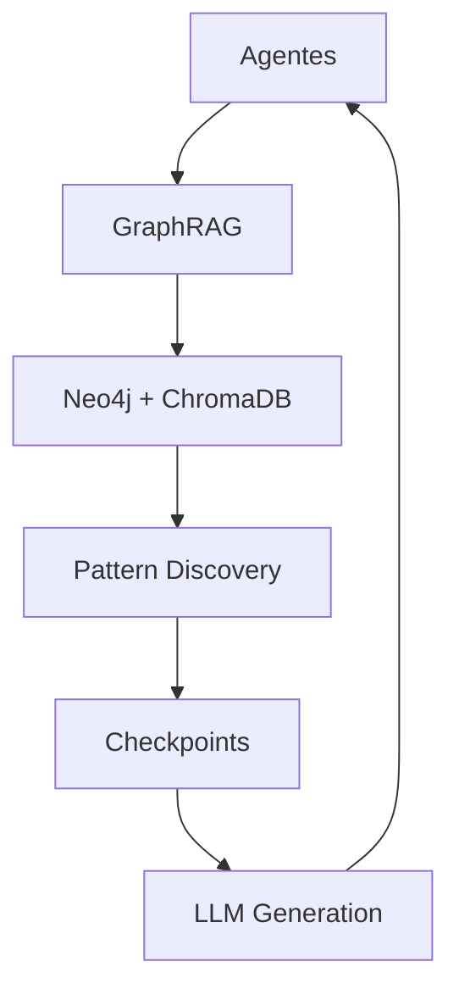

# Reflexive Self Coding Assistant (RSCA) v4.0

O RSCA é um assistente de codificação autônomo baseado em agentes evolutivos e GraphRAG (Graph Retrieval-Augmented Generation), implementando a Reflexive Self Theory para aprendizado contínuo e auto-aperfeiçoamento.

## Componentes Principais
- **Agentes Evolutivos**: 
  - `CodeAgentEnhanced`: Geração de código com aprendizado experiencial
  - `TestAgent`: Validação automática e garantia de qualidade
  - `DocumentationAgent`: Documentação contextual automática
  - `ReflectionAgent`: Meta-análise baseada em GraphRAG
- **GraphRAG Memory**: 
  - Neo4j: Grafo de conhecimento para experiências e relações
  - ChromaDB: Banco vetorial para busca semântica
  - Pattern Discovery: Identificação automática de padrões
- **Sistema de Checkpoints**: Versionamento completo de agentes
- **LLM Management**: 
  - CodeLlama, Llama3 e Qwen2 via Ollama
  - Seleção automática de modelo por tarefa
- **Dashboard Avançado**: Monitoramento em tempo real via Streamlit

## Arquitetura


Principais características:
- Persistência unificada em GraphRAG
- Descoberta automática de padrões
- Evolução contínua de agentes
- Reflexão simbólica recursiva

Para detalhes completos: [ARCHITECTURE.md](docs/ARCHITECTURE.md)

## Roadmap 2026
- Distributed GraphRAG
- Advanced specialization
- Real-time collaboration
- Cloud deployment

Ver roadmap completo: [rsca_roadmap_04.06.2025.md](docs/rsca_roadmap_04.06.2025.md)

## Requisitos
- Python 3.10+
- Neo4j 5.14+
- ChromaDB 0.4.15+
- 6-8GB RAM, 20GB disco

Lista completa: [REQUIREMENTS.md](docs/REQUIREMENTS.md)

## Instalação
```bash
git clone https://github.com/seu-repositorio/rsca.git
cd rsca
pip install -r requirements.txt
```

Ver guia detalhado: [instrucoes_execucao_20250529.md](docs/instrucoes_execucao_20250529.md)

## Licença
MIT License - Ver [LICENSE](LICENSE) para detalhes
