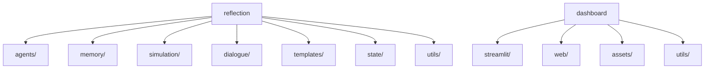

# Plano de Reorganização da Estrutura de Arquivos

## Objetivo
Centralizar os caminhos de arquivos e reorganizar a estrutura para melhor manutenibilidade.

## Estrutura Proposta



## Implementação

1. **Fase 1 - Configuração**:
   - Criar `config/paths.py` com:
   ```python
   REFLECTION_DIR = "reflection"
   IDENTITY_STATE = f"{REFLECTION_DIR}/identity_state.yaml"
   # ... demais caminhos
   ```

2. **Fase 2 - Atualização**:
   - Atualizar imports para usar caminhos centralizados
   - Mover arquivos para novas pastas

3. **Fase 3 - Validação**:
   - Testar todos os fluxos principais
   - Remover caminhos hardcoded antigos

## Próximos Passos
Solicitar mudança para modo Code para implementação.