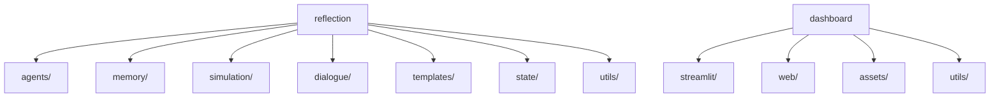

Analisando a estrutura atual, proponho a seguinte reorganização:

1. Para a pasta `reflection`:
- Criar subpastas por funcionalidade:
  * `agents/` (supervisor, meta_coordinator)
  * `memory/` (todos os arquivos relacionados a memória)
  * `simulation/` (simulador, cenários)
  * `dialogue/` (diálogos, explicações)
  * `templates/` (templates de prompts)
  * `state/` (arquivos YAML de estado)
  * `utils/` (ferramentas auxiliares)

2. Para o dashboard:
- Criar pasta `dashboard/` com:
  * `streamlit/` (versão streamlit)
  * `web/` (futura versão web)
  * `assets/` (recursos visuais)
  * `utils/` (funções compartilhadas)

Vou criar um diagrama mermaid para ilustrar a nova estrutura proposta:

Agora vou detalhar o mapeamento completo dos arquivos para as novas pastas:

1. Pasta reflection reorganizada:
- agents/
  * supervisor_agent.py
  * meta_coordinator.py
  * strategy_planner.py
- memory/
  * symbolic_memory.py
  * memory_log.yaml
  * identity_state.yaml
  * emotional_state.yaml
- simulation/
  * simulator.py
  * scenarios.yaml
  * simulated_decision.yaml
- dialogue/
  * symbolic_dialogue.py
  * symbolic_dialogue.yaml
  * dialogue_based_filter.py
  * natural_explainer.py
- templates/
  * prompt_templates/
- state/
  * symbolic_*.yaml (exceto diálogo)
- utils/
  * *.py (ferramentas auxiliares)

2. Dashboard:
- Mover dashboard_streamlit.py para dashboard/streamlit/
- Criar estrutura básica para futura expansão