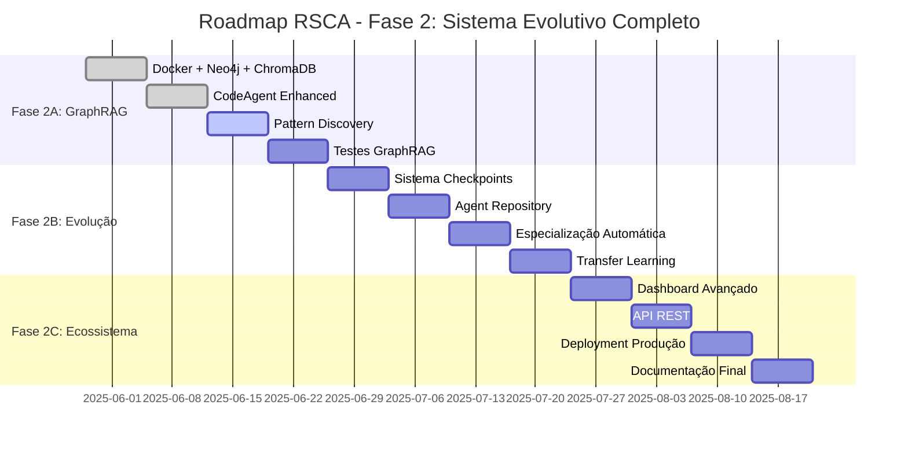

# 🚀 RSCA - Plano Estratégico Completo: Sistema Evolutivo

**Data:** 28 de Maio de 2025  
**Objetivo:** Evoluir da base sólida atual para o sistema evolutivo completo previsto no plano original  
**Prazo:** 3 meses (12 semanas)  
**Filosofia:** Incrementalismo sem quebrar o que funciona  

---

## 📊 **RESUMO EXECUTIVO**

Vamos transformar o RSCA atual (sistema otimizado e funcional) no sistema evolutivo completo planejado, seguindo uma abordagem de **"evolução conservadora"** - cada etapa adiciona capacidade sem quebrar funcionalidades existentes.

### **🎯 OBJETIVOS FINAIS (90 dias)**
- ✅ **Base Atual Preservada**: Sistema otimizado continua funcionando
- 🔄 **GraphRAG Implementado**: Memória experiencial funcionando
- 🤖 **Agentes Evolutivos**: Capacidade de auto-melhoria
- 🏪 **Agent Repository**: Sistema de especialização e transferência
- 📊 **Dashboard Avançado**: Visualização da evolução
- 🐳 **Deploy Completo**: Docker Compose produção-pronto

---

## 🗺️ **ROADMAP DETALHADO**



### **FASE 2A: Memória Experiencial (Semanas 1-4)**
*Adicionar GraphRAG mantendo compatibilidade com sistema atual*

### **FASE 2B: Evolução de Agentes (Semanas 5-8)**  
*Implementar capacidades de auto-melhoria e especialização*

### **FASE 2C: Ecossistema Completo (Semanas 9-12)**
*Agent Repository, Dashboard Avançado e Deploy*

---

## 🔄 **FASE 2A: IMPLEMENTAÇÃO DE MEMÓRIA EXPERIENCIAL**
**Semanas 1-4 | Foco: GraphRAG + Pattern Discovery**

### **Semana 1: Infraestrutura de Dados**

#### **🎯 Objetivos**
- Neo4j + ChromaDB funcionando
- Integração híbrida (YAML + Grafo)
- Testes de conectividade

#### **📋 Entregáveis**

##### **1. Docker Compose Expandido**

```yaml
# infrastructure/docker-compose.yml
version: '3.8'

services:
  # Sistema RSCA Principal (preservando atual)
  rsca-app:
    build:
      context: .
      dockerfile: Dockerfile
    container_name: rsca-main
    ports:
      - "8501:8501"  # Streamlit Dashboard
      - "8080:8080"  # API REST (futuro)
    environment:
      # Configurações atuais preservadas
      - OLLAMA_HOST=http://ollama:11434
      - NEO4J_URI=bolt://neo4j:7687
      - NEO4J_USERNAME=neo4j
      - NEO4J_PASSWORD=rsca_secure_2025
      - CHROMADB_HOST=chromadb
      - CHROMADB_PORT=8000
      # Modo híbrido: YAML + GraphRAG
      - STORAGE_MODE=hybrid
      - ENABLE_GRAPHRAG=true
    volumes:
      - ./data:/app/data
      - ./logs:/app/logs  
      - ./reflection:/app/reflection  # Preservar estados YAML
      - ./exports:/app/exports
    depends_on:
      - neo4j
      - chromadb
      - ollama
    restart: unless-stopped

  # Ollama para LLMs Locais (configuração atual preservada)
  ollama:
    image: ollama/ollama:latest
    container_name: rsca-ollama
    ports:
      - "11434:11434"
    volumes:
      - ollama_data:/root/.ollama
    environment:
      - OLLAMA_HOST=0.0.0.0
    restart: unless-stopped

  # Neo4j para GraphRAG (NOVO)
  neo4j:
    image: neo4j:5.15-community
    container_name: rsca-neo4j
    ports:
      - "7474:7474"  # Browser
      - "7687:7687"  # Bolt
    environment:
      - NEO4J_AUTH=neo4j/rsca_secure_2025
      - NEO4J_PLUGINS=["apoc", "gds"]
      - NEO4J_dbms_security_procedures_unrestricted=apoc.*,gds.*
      - NEO4J_dbms_memory_heap_initial_size=512m
      - NEO4J_dbms_memory_heap_max_size=2g
    volumes:
      - neo4j_data:/data
      - neo4j_logs:/logs
      - ./infrastructure/neo4j/init:/docker-entrypoint-initdb.d
    restart: unless-stopped

  # ChromaDB para Vector Search (NOVO)
  chromadb:
    image: chromadb/chroma:latest
    container_name: rsca-chromadb
    ports:
      - "8000:8000"
    environment:
      - CHROMA_SERVER_HOST=0.0.0.0
      - CHROMA_SERVER_PORT=8000
      - CHROMA_SERVER_AUTH_CREDENTIALS_PROVIDER=chromadb.auth.token.TokenAuthCredentialsProvider
      - CHROMA_SERVER_AUTH_TOKEN_TRANSPORT_HEADER=X-Chroma-Token
      - CHROMA_AUTH_TOKEN_SECRET=rsca_chroma_secret_2025
    volumes:
      - chromadb_data:/chroma/chroma
    restart: unless-stopped

volumes:
  neo4j_data:
  neo4j_logs:
  chromadb_data:
  ollama_data:
```

##### **2. Schema de GraphRAG**

```cypher
// infrastructure/neo4j/init/01_schema.cypher
// Schema para RSCA GraphRAG - Design híbrido com sistema YAML atual

// =====================================
// CONSTRAINTS E ÍNDICES
// =====================================

// Experiências de Codificação
CREATE CONSTRAINT experience_id FOR (e:Experience) REQUIRE e.id IS UNIQUE;
CREATE CONSTRAINT task_id FOR (t:Task) REQUIRE t.id IS UNIQUE;
CREATE CONSTRAINT code_hash FOR (c:Code) REQUIRE c.hash IS UNIQUE;
CREATE CONSTRAINT pattern_name FOR (p:Pattern) REQUIRE p.name IS UNIQUE;
CREATE CONSTRAINT agent_name FOR (a:Agent) REQUIRE a.name IS UNIQUE;

// Índices de Performance
CREATE INDEX experience_quality FOR (e:Experience) ON (e.quality_score);
CREATE INDEX experience_timestamp FOR (e:Experience) ON (e.timestamp);
CREATE INDEX task_domain FOR (t:Task) ON (t.domain);
CREATE INDEX code_language FOR (c:Code) ON (c.language);
CREATE INDEX pattern_success_rate FOR (p:Pattern) ON (p.success_rate);

// =====================================
// SCHEMA DE NÓS
// =====================================

// Experiência de Codificação (centro do grafo)
CREATE (exp:Experience {
    id: "exp_example_001",
    task_description: "Implementar função de login",
    quality_score: 8.5,
    execution_success: true,
    timestamp: datetime(),
    agent_name: "CodeAgent",
    llm_model: "qwen2:1.5b",
    context_tokens: 1024,
    response_tokens: 256,
    generation_time: 2.3,
    // Conexão com sistema YAML atual
    yaml_cycle: 1,
    yaml_identity_backup: "reflection/state/identity/identity_state.yaml"
});

CREATE (task:Task {
    id: "task_example_001", 
    description: "Implementar função de login",
    domain: "authentication",
    complexity: "medium",
    requirements: ["validation", "security", "error_handling"],
    context_size: 512
});

CREATE (code:Code {
    id: "code_example_001",
    hash: "sha256_abc123...",
    content: "def login(username, password):\n    # código aqui\n    return True",
    language: "python",
    lines_count: 15,
    functions_count: 1,
    classes_count: 0,
    complexity_score: 3,
    syntax_valid: true
});

CREATE (pattern:Pattern {
    id: "pattern_example_001",
    name: "input_validation_pattern",
    template: "if not input or len(input.strip()) == 0: raise ValueError(...)",
    success_rate: 0.89,
    usage_count: 47,
    discovery_date: datetime(),
    contexts: ["login", "user_input", "api_endpoints"]
});

CREATE (agent:Agent {
    id: "agent_codeagent_v1",
    name: "CodeAgent",
    version: "1.0",
    specialization: "code_generation",
    current_llm: "qwen2:1.5b",
    total_experiences: 0,
    avg_quality_score: 0.0,
    consistency_level: "Alta",
    // Ponte com sistema simbólico atual
    yaml_identity_path: "reflection/state/identity/identity_state.yaml",
    symbolic_traits: ["Consistente", "Objetivo"]
});

// =====================================
// RELAÇÕES
// =====================================

// Conexões principais
CREATE (exp)-[:EXECUTED_TASK]->(task);
CREATE (exp)-[:GENERATED_CODE]->(code);
CREATE (exp)-[:USED_PATTERN]->(pattern);
CREATE (exp)-[:PERFORMED_BY]->(agent);

// Relações de similaridade e evolução
CREATE (exp)-[:SIMILAR_TO {similarity_score: 0.85}]->(exp);
CREATE (code)-[:EVOLVED_FROM {improvements: ["added_validation", "better_error_handling"]}]->(code);
CREATE (pattern)-[:DERIVED_FROM]->(pattern);
CREATE (agent)-[:LEARNED_FROM]->(exp);

// Remover exemplos
MATCH (n) WHERE n.id CONTAINS "example_001" DELETE n;

// =====================================
// FUNÇÕES UTILITÁRIAS
// =====================================

// Função para calcular similaridade de tarefas
CALL gds.graph.project(
    'task_similarity',
    'Task',
    'SIMILAR_TO'
);

// Função para encontrar padrões emergentes
CREATE OR REPLACE FUNCTION rsca.find_emerging_patterns() 
RETURNS LIST<MAP<STRING, ANY>> AS
$$
    MATCH (e:Experience)-[:USED_PATTERN]->(p:Pattern)
    WHERE e.timestamp > datetime() - duration("P30D")
    WITH p, COUNT(e) as recent_usage
    WHERE recent_usage > 5
    RETURN collect({
        pattern: p.name,
        recent_usage: recent_usage,
        success_rate: p.success_rate
    })
$$;
```

##### **3. Sistema de Memória Híbrida**

```python
# memory/hybrid_store.py
"""
Sistema de Memória Híbrida - Preserva YAML atual + adiciona GraphRAG
Estratégia: Compatibilidade total com sistema existente
"""

import yaml
import json
from datetime import datetime
from typing import Dict, List, Optional, Any
from dataclasses import dataclass
from pathlib import Path

from neo4j import GraphDatabase
import chromadb
from sentence_transformers import SentenceTransformer

from config.paths import (
    IDENTITY_STATE, MEMORY_LOG, CYCLE_HISTORY,
    SYMBOLIC_TIMELINE, EMOTIONAL_STATE
)

@dataclass
class CodingExperience:
    """Estrutura padronizada para experiências de codificação"""
    id: str
    task_description: str
    code_generated: str
    quality_score: float
    execution_success: bool
    agent_name: str
    llm_model: str
    timestamp: datetime
    context: Dict[str, Any]
    yaml_cycle: int  # Conecta com sistema atual

class HybridMemoryStore:
    """
    Armazena experiências tanto em YAML (compatibilidade) quanto em GraphRAG (evolução)
    """
    
    def __init__(self, enable_graphrag: bool = True):
        self.enable_graphrag = enable_graphrag
        
        # Sistema YAML atual (preservado)
        self.yaml_paths = {
            'identity': IDENTITY_STATE,
            'memory': MEMORY_LOG, 
            'history': CYCLE_HISTORY,
            'timeline': SYMBOLIC_TIMELINE,
            'emotional': EMOTIONAL_STATE
        }
        
        # GraphRAG (novo)
        if enable_graphrag:
            self._setup_graphrag()
        
        # Embeddings para similaridade
        self.encoder = SentenceTransformer('all-MiniLM-L6-v2')
        
    def _setup_graphrag(self):
        """Inicializa conexões Neo4j e ChromaDB"""
        try:
            # Neo4j
            self.neo4j = GraphDatabase.driver(
                "bolt://localhost:7687",
                auth=("neo4j", "rsca_secure_2025")
            )
            
            # ChromaDB
            self.chroma_client = chromadb.HttpClient(
                host="localhost",
                port=8000,
                headers={"X-Chroma-Token": "rsca_chroma_secret_2025"}
            )
            
            # Collection para experiências de código
            self.experiences_collection = self.chroma_client.get_or_create_collection(
                name="coding_experiences",
                metadata={"description": "RSCA coding experiences with embeddings"}
            )
            
            print("✅ GraphRAG conectado: Neo4j + ChromaDB")
            
        except Exception as e:
            print(f"⚠️ GraphRAG não disponível: {e}")
            self.enable_graphrag = False
    
    def store_experience(self, experience: CodingExperience) -> bool:
        """
        Armazena experiência em ambos os sistemas:
        1. YAML (compatibilidade com sistema atual)
        2. GraphRAG (capacidades avançadas)
        """
        success_yaml = self._store_yaml_compatible(experience)
        success_graph = True
        
        if self.enable_graphrag:
            success_graph = self._store_graphrag(experience)
        
        return success_yaml and success_graph
    
    def retrieve_similar_experiences(self, query: str, k: int = 5) -> List[Dict]:
        """
        Busca experiências similares usando tanto YAML quanto GraphRAG
        """
        results = []
        
        # 1. Busca no sistema YAML atual (compatibilidade)
        yaml_results = self._search_yaml_experiences(query)
        results.extend(yaml_results)
        
        # 2. Busca no GraphRAG (capacidades avançadas)
        if self.enable_graphrag:
            graph_results = self._search_graphrag_experiences(query, k)
            results.extend(graph_results)
        
        # 3. Remover duplicatas e ranquear
        unique_results = self._deduplicate_and_rank(results, query)
        
        return unique_results[:k]
    
    # [Implementação completa dos métodos internos...]
    
    def close(self):
        """Fecha conexões"""
        if self.enable_graphrag and hasattr(self, 'neo4j'):
            self.neo4j.close()
```

#### **🚀 Comandos Semana 1**

```bash
# 1. Setup da infraestrutura
docker-compose -f infrastructure/docker-compose.yml up -d

# 2. Verificar serviços
docker ps  # Deve mostrar: rsca-app, neo4j, chromadb, ollama

# 3. Instalar dependências Python
pip install neo4j chromadb sentence-transformers

# 4. Testar integração híbrida
python memory/hybrid_store.py

# 5. Verificar compatibilidade com sistema atual
python scripts/tests/test_quick.py
```

### **Semana 2: CodeAgent com GraphRAG**

#### **🎯 Objetivos**
- CodeAgent usa experiências passadas para gerar código melhor
- Compatibilidade 100% com sistema atual
- Primeiras experiências armazenadas no grafo

#### **📋 Entregáveis**

##### **CodeAgent Enhanced com GraphRAG**

```python
# core/agents/code_agent_enhanced.py
"""
CodeAgent Enhanced - Integra GraphRAG mantendo compatibilidade total
Evolução do CodeAgent atual com capacidades de memória experiencial
"""

import yaml
import ast
from datetime import datetime
from typing import Dict, Any, Optional, Tuple, List
from dataclasses import dataclass

from memory.hybrid_store import HybridMemoryStore, CodingExperience
from core.llm.llm_manager import llm_manager, MockLLMManager
from config.paths import IDENTITY_STATE

@dataclass 
class CodeResult:
    """Resultado da geração/execução de código (preservado do atual)"""
    code: str
    success: bool
    execution_result: Optional[str] = None
    error: Optional[str] = None
    quality_score: float = 0.0
    execution_time: float = 0.0
    # Novos campos para GraphRAG
    experience_id: Optional[str] = None
    similar_experiences_used: List[Dict] = None
    learning_applied: bool = False

class CodeAgentEnhanced:
    """
    CodeAgent com capacidades GraphRAG - Preserva interface atual + adiciona evolução
    """
    
    def __init__(self, use_mock: bool = False, enable_graphrag: bool = True):
        # Configuração atual preservada
        self.llm = MockLLMManager() if use_mock else llm_manager
     