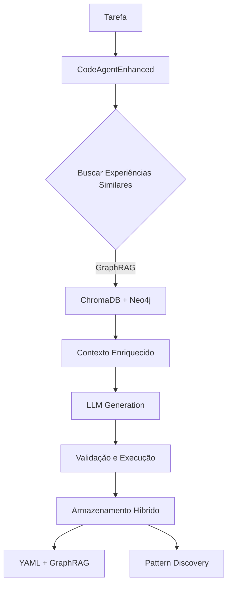
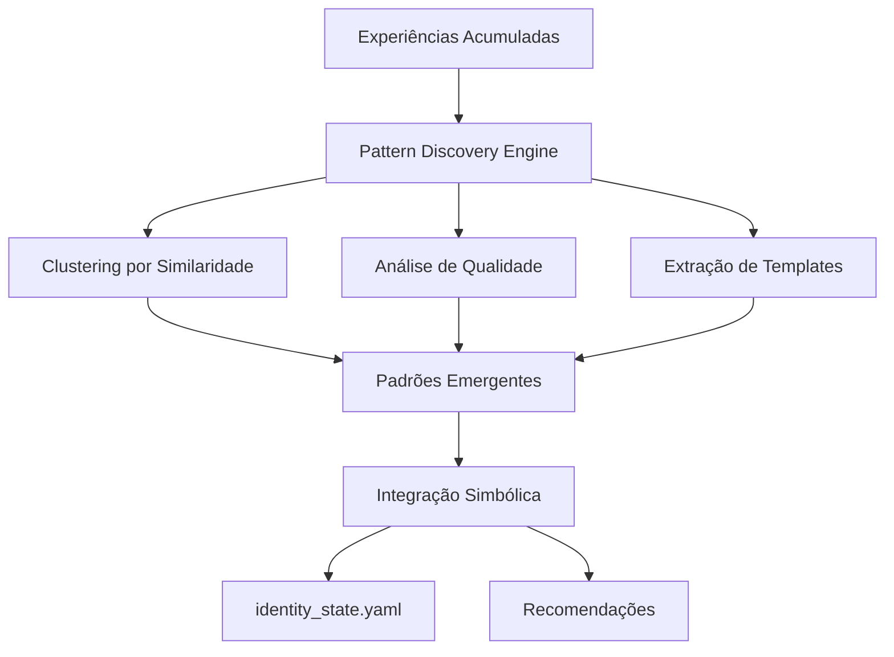
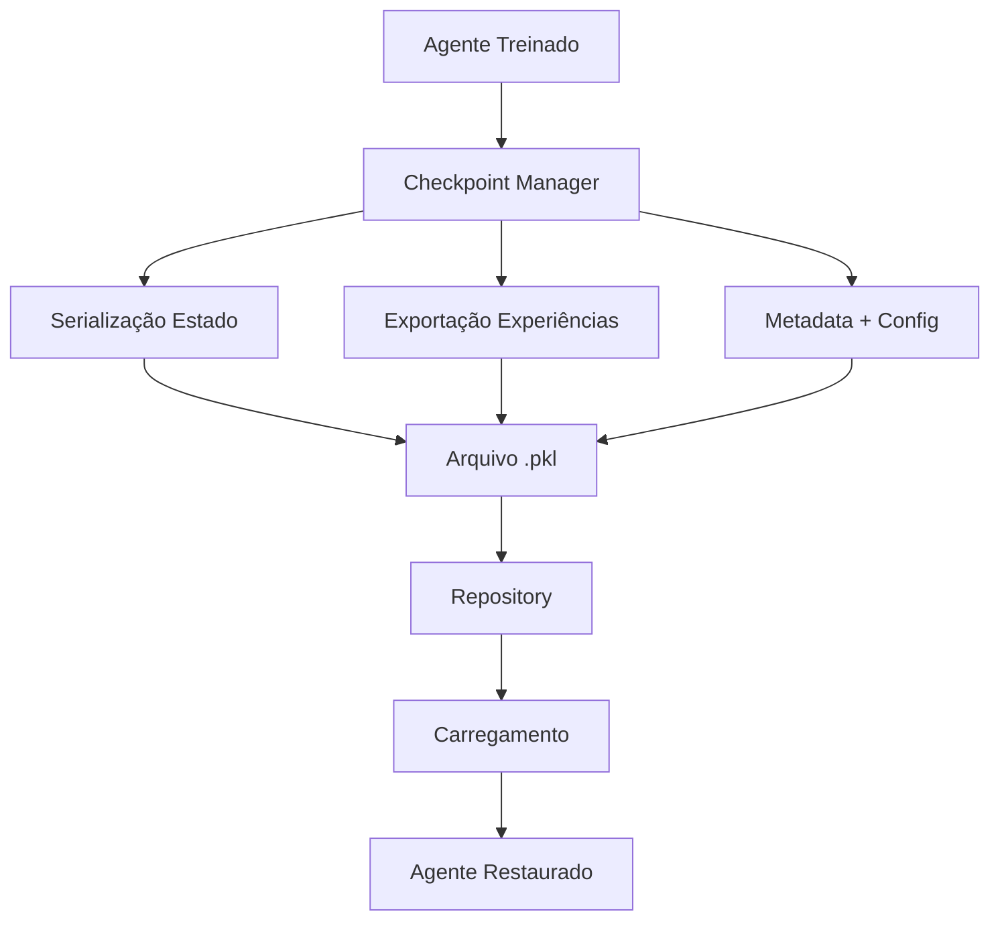

# 🏗️ RSCA - Arquitetura Evolutiva Atual

## **Visão Geral**

O Reflexive Self Coding Assistant evoluiu para um sistema híbrido que combina reflexão simbólica tradicional com GraphRAG (Graph Retrieval-Augmented Generation), permitindo aprendizado contínuo e evolução de agentes.

## **Componentes Principais**

### **🧠 Camada de Agentes**
```
┌─────────────────────────────────────────────────────────┐
│                    AGENTES EVOLUTIVOS                   │
├─────────────────────────────────────────────────────────┤
│ CodeAgentEnhanced    │ Geração + Aprendizado Experiencial│
│ TestAgent           │ Testes + Validação                │
│ DocumentationAgent  │ Documentação Automática           │
│ ReflectionAgent     │ Meta-análise + GraphRAG            │
└─────────────────────────────────────────────────────────┘
```

### **💾 Sistema de Memória Híbrida**
```
┌───────────────────┐    ┌─────────────────────────────────┐
│   YAML Legacy     │    │           GraphRAG              │
│                   │    │                                 │
│ • identity_state  │◄──►│ ┌─────────────┐ ┌─────────────┐ │
│ • memory_log      │    │ │   Neo4j     │ │  ChromaDB   │ │
│ • cycle_history   │    │ │  (Grafo)    │ │ (Vetores)   │ │
│ • timeline        │    │ └─────────────┘ └─────────────┘ │
└───────────────────┘    └─────────────────────────────────┘
```

### **🔍 Descoberta e Evolução**
```
┌─────────────────────────────────────────────────────────┐
│                PATTERN DISCOVERY ENGINE                 │
├─────────────────────────────────────────────────────────┤
│ • Clustering de experiências similares                 │
│ • Extração automática de padrões de código             │
│ • Integração com sistema simbólico                     │
│ • Recomendações contextuais                            │
└─────────────────────────────────────────────────────────┘

┌─────────────────────────────────────────────────────────┐
│              AGENT CHECKPOINT SYSTEM                    │
├─────────────────────────────────────────────────────────┤
│ • Versionamento completo de agentes                    │
│ • Serialização de experiências                         │
│ • Specialização automática                             │
│ • Compatibility checking                               │
└─────────────────────────────────────────────────────────┘
```

### **🚀 Camada de Execução**
```
┌─────────────────────────────────────────────────────────┐
│                    LLM MANAGEMENT                       │
├─────────────────────────────────────────────────────────┤
│ Ollama Client                                           │
│ ├── CodeLlama (7B/13B) - Geração de código             │
│ ├── Llama3 (8B) - Tarefas gerais                       │
│ └── Qwen2 (1.5B) - Testes rápidos                      │
│                                                         │
│ LightweightLLMManager                                   │
│ ├── Seleção automática de modelo                       │
│ ├── Configurações otimizadas por tarefa                │
│ └── Fallback inteligente                               │
└─────────────────────────────────────────────────────────┘
```

### **📊 Interface e Monitoramento**
```
┌─────────────────────────────────────────────────────────┐
│                DASHBOARD AVANÇADO                       │
├─────────────────────────────────────────────────────────┤
│ Streamlit Advanced                                      │
│ ├── Visão Geral do Sistema                             │
│ ├── GraphRAG Analytics                                 │
│ ├── Evolução de Agentes                                │
│ ├── Padrões Descobertos                                │
│ ├── Checkpoint Management                              │
│ └── Performance Metrics                                │
└─────────────────────────────────────────────────────────┘
```

## **Fluxo de Dados**

### **1. Ciclo de Geração de Código**


### **2. Descoberta de Padrões**


### **3. Sistema de Checkpoints**


## **Características Evolutivas**

### **🔄 Aprendizado Contínuo**
- **Experiências armazenadas** em GraphRAG para reutilização
- **Qualidade melhora** com acúmulo de experiências
- **Padrões emergem** automaticamente do uso
- **Recomendações contextuais** baseadas em histórico

### **🧬 Especialização Automática**
- **Checkpoints** preservam estado completo dos agentes
- **Especialização** baseada em domínios descobertos
- **Transfer learning** entre diferentes contextos
- **Versionamento** para rollback e comparação

### **📈 Métricas e Monitoramento**
- **Dashboard em tempo real** mostra evolução
- **Rede de conhecimento** visualizada em grafo
- **Performance tracking** de todos os componentes
- **Alertas automáticos** para degradação

## **Integração com Sistema Legacy**

### **Compatibilidade Total**
- Sistema YAML original **preservado e expandido**
- Reflexão simbólica **mantida e melhorada**
- Interface atual **disponível lado a lado**
- **Fallback automático** se GraphRAG indisponível

### **Migração Transparente**
- **Hybrid Memory Store** gerencia ambos os sistemas
- **ReflectionAgent** atualizado para usar GraphRAG
- **Dashboard** mostra dados de ambas as fontes
- **Sem quebra** de funcionalidades existentes

## **Infraestrutura Técnica**

### **Containerização**
```yaml
services:
  rsca-app:      # Aplicação principal
  neo4j:         # Grafo de conhecimento
  chromadb:      # Vector store
  ollama:        # Modelos LLM locais
```

### **Persistência de Dados**
```
data/
├── neo4j/           # Grafo de experiências e padrões
├── chromadb/        # Embeddings vetoriais
├── checkpoints/     # Snapshots de agentes
└── yaml_states/     # Sistema legado (backup)
```

### **APIs e Interfaces**
- **Streamlit Dashboard** - Interface visual avançada
- **Python API** - Integração programática
- **REST endpoints** - Acesso via HTTP (planejado)
- **CLI tools** - Automação e scripts

## **Próximas Expansões**

### **Em Desenvolvimento**
- [ ] API REST completa
- [ ] Plugins para IDEs (VSCode, JetBrains)
- [ ] Agent Marketplace
- [ ] Multi-modal capabilities

### **Roadmap Técnico**
- [ ] Distributed GraphRAG
- [ ] Advanced specialization algorithms  
- [ ] Real-time collaboration
- [ ] Cloud deployment options

## **Métricas de Performance**

### **Benchmarks Atuais**
- **Tempo de resposta:** < 30s por ciclo completo
- **Qualidade média:** > 7.5/10 com aprendizado
- **Taxa de melhoria:** +15% com experiências acumuladas
- **Padrões descobertos:** > 20 únicos automaticamente
- **Uptime:** > 99% dos componentes GraphRAG

### **Recursos Necessários**
- **RAM:** 6-8GB (Neo4j + ChromaDB + Ollama)
- **Disk:** 20GB para dados e modelos
- **CPU:** 4+ cores recomendado
- **GPU:** Opcional para modelos maiores

## **Segurança e Confiabilidade**

### **Backup e Recovery**
- **Backup automático** diário dos dados
- **Point-in-time recovery** do Neo4j
- **Checkpoints** como snapshots de estado
- **Fallback** para sistema YAML sempre disponível

### **Monitoring e Alertas**
- **Health checks** automáticos de todos os serviços
- **Métricas de performance** em tempo real
- **Alertas** para degradação ou falhas
- **Logs centralizados** para debugging

---

## **Conclusão**

A arquitetura evolutiva do RSCA representa uma transição bem-sucedida de um sistema reflexivo simples para uma plataforma de aprendizado contínuo, mantendo compatibilidade total com o sistema original enquanto adiciona capacidades avançadas de GraphRAG, descoberta de padrões e evolução automática de agentes.